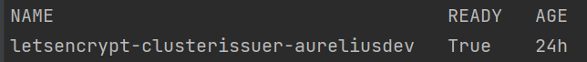
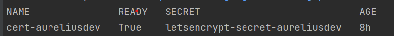

# How to Deploy Aurelius Atlas

Getting started
-------------------------

Welcome to the Aurelius Atlas solution powered by Apache Atlas! Aurelius Atlas is an open-source Data Governance solution, based on a selection of open-source tools to facilitate business users to access governance information in an easy consumable way and meet the data governance demands of the distributed data world.


Here you will find the instillation instructions and the required setup of the kubernetes instructions, followed by how to deploy the chart in different namespaces. 

Installation Requirements
-------------------------

This installation assumes that you have:
- a kubernetes cluster running
  - with 2 Node of CPU 4 and 16GB
- Chosen cloud Cli installed 
  - [gcloud](https://cloud.google.com/sdk/docs/install#deb)
  - [az](https://learn.microsoft.com/en-us/cli/azure/install-azure-cli)
- kubectl installed and linked to chosen cloud Cli
  - [gcloud linked](https://cloud.google.com/kubernetes-engine/docs/how-to/cluster-access-for-kubectl#gcloud)
  - [az linked](https://learn.microsoft.com/en-us/azure/aks/learn/quick-kubernetes-deploy-cli#connect-to-the-cluster)
- A DomainName
  - Not necessary for Azure

## Required Packages
The deployment requires the following packages:
- Certificate Manager
  - To handel and manage the creation of certificates
  - Used in demo: cert-manager
- Ingress Controller
  - Used to create an entry point to the cluster through an external IP.
  - Used in demo: Nginx Controller
- Elastic
  - Used to deploy elastic on the kubernetes cluster
  - In order to deploy elastic, ``Elastic Cluster on Kubernetes (ECK)`` must be installed on the cluster. To install ECK on the cluster, please follow the instructions provided on https://www.elastic.co/guide/en/cloud-on-k8s/master/k8s-deploy-eck.html
  - For more details about this elastic helm chart look at [elastic readme](./charts/elastic/README.md)
- Reflector
  - Used to reflect secrets across namespaces
  - Used in demo to share the DNS certificate to different namespace

### The steps on how to install the required packages

##### 1. Install Certificate manager
Only install if you do not have a certificate manager. Please be aware if you use another manger, some commands later will need adjustments.
The certificate manager here is [cert-manager](https://cert-manager.io/docs/installation/helm/).

```bash
helm repo add jetstack https://charts.jetstack.io
helm repo update
helm install  cert-manager jetstack/cert-manager   --namespace cert-manager   --create-namespace   --version v1.9.1 
```
##### 2. Install Ingress Nginx Controller
Only install if you do not have an Ingress Controller. 

```bash
helm repo add ingress-nginx https://kubernetes.github.io/ingress-nginx
helm repo update
helm install nginx-ingress ingress-nginx/ingress-nginx --set controller.publishService.enabled=true
```
##### 3. Install Elastic
```bash
kubectl create -f https://download.elastic.co/downloads/eck/2.3.0/crds.yaml
kubectl apply -f https://download.elastic.co/downloads/eck/2.3.0/operator.yaml
```
##### 4. Install Reflector
```bash
helm repo add emberstack https://emberstack.github.io/helm-charts
helm repo update
helm upgrade --install reflector emberstack/reflector
```

## Get Ingress Controller External IP to link to DNS 
Only do this if your ingress controller does not already have a DNS applied. In the case of Azure this is not necessary, other possible instructions can be found below in Azure DNS Label
##### Get External IP to link to DNS
```bash
kubectl get service/nginx-ingress-ingress-nginx-controller
```
Take the external-IP of the ingress controller
Link your DNS to this external IP.

In Azure, it is possible to apply a dns label to the ingress controller, if you do not have a DNS.
#### Azure DNS Label
https://hovermind.com/azure-kubernetes-service/applying-dns-label-to-the-service.html
Edit the ingress controller deployment 
```bash
kubectl edit deployment.apps/nginx-ingress-ingress-nginx-controller
```
Under Annotations add the following providing your desire label <label>:

```
service.beta.kubernetes.io/azure-dns-label-name: <label>
```
Save and exit.
Resulting DSN will be ``<label>.westeurope.cloudapp.azure.com``


## Put ssl certificate in a Secret

##### Define a cluster issuer
This is needed if you installed letsencrypt from the required packages. 

Here we define a CLusterIssuer using letsencrypt on the cert-manager namespace
- move to the directory of the chart helm-governance
* uncomment prod_issuer.yaml in templates
* update the ``{{ .Values.ingress.email_address }}`` in Values file
* Create the clusterIssuer with the following command
```bash
helm template -s templates/prod_issuer.yaml . | kubectl apply -f -
```
comment out prod_issuer.yaml in templates
Check that it is running:
```bash
kubectl get clusterissuer -n cert-manager 
```
It is running when Ready is True.




##### Create ssl certificate 
This is needed if you installed letsencrypt from the required packages. 

- Assumes you have a DNS linked to the external IP of the ingress controller
- move to the directory of the chart helm-governance
* uncomment prod_issuer.yaml in templates
* update the Values file ``{{ .Values.ingress.dns_url}}`` to your DNS name 
* Create the certificate with the following command
```bash
helm template -s templates/certificate.yaml . | kubectl apply -f -
```
comment out certificate.yaml in templates
Check that it is approved.
```bash
kubectl get certificate -n cert-manager 
```
It is running when Ready is True





Deploy Aurelius Atlas
-------------------------
- Create the namespace
- Update the Values file 
  - DNS name
  - external IP
deploy the services

```bash
kubectl create namespace <namespace>
cd helm-governance
helm dependency update
helm install --generate-name -n <namespace>  -f values.yaml .
```
### Users with Randomized Passwords
In the helm chart 5 base users are created with randomized passwords stored as secrets on kubernetes.


The 5 base users are:
1. Keycloak Admin User
2. Atlas Admin User
3. Atlas Data Steward User
4. Atlas Data User
5. Elastic User

To get the randomized passwords out of kubernetes there is a bash script get_passwords. 

```bash
./get_passwords.sh <namespace>
```

The above command scans the given ``<namespace>`` and prints the usernames and randomized passwords as follows:
```
keycloak admin user pwd:
username: admin
vntoLefBekn3L767
----
keycloak Atlas admin user pwd:
username: atlas
QUVTj1QDKQWZpy27
----
keycloak Atlas data steward user pwd:
username: steward
XFlsi25Nz9h1VwQj
----
keycloak Atlas data user pwd:
username: scientist
PPv57ZvKHwxCUZOG
==========
elasticsearch elastic user pwd:
username: elastic
446PL2F2UF55a19haZtihRm5
----
```


#### Check that all pods are running
``` bash
kubectl -n <namespace> get all # check that all pods are running
```
Atlas is now accessible via reverse proxy at ``<DNS-url>/<namespace>/atlas/``


## Initialize the Atlas flink tasks and optionally load sample data

Flink:
- For more details about this flink helm chart look at [flink readme](./charts/flink/README.md)


Init Jobs:
- Create the Atlas Users in Keycloak
- Create the App Search Engines in Elastic

```bash ${1}
kubectl -n <namespace> exec -it <pod/flink-jobmanager-pod-name> -- bash
cd init
#./init_jobs.sh
pip3 install m4i-atlas-core@git+https://github.com/aureliusenterprise/m4i_atlas_core.git#egg=m4i-atlas-core --upgrade
cd py_libs/m4i-flink-tasks/scripts
/opt/flink/bin/flink run -d -py get_entity_job.py
/opt/flink/bin/flink run -d -py publish_state_job.py
/opt/flink/bin/flink run -d -py determine_change_job.py
/opt/flink/bin/flink run -d -py synchronize_appsearch_job.py
/opt/flink/bin/flink run -d -py local_operation_job.py
## To Load the Sample Demo Data 
./load_sample_data.sh
```
