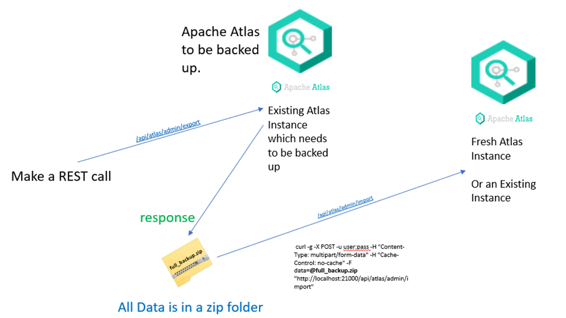

# Aurelius Atlas Backup

Here you will find how to back up Aurelius Atlas for moving instances.

This process will result in zip files of the Aurelius Atlas instance that can be used for backup and in the case of disaster recover process. 


### Apache Atlas Process Overview


The Import-Export APIs for Atlas facilitate transfer of data to and from an instance of Apache Atlas.
These APIs are available only to **admin user**.
To connect to the atlas backend a bearer token of an admin user is needed.

Get Bearer Token for admin user
```bash
curl --location --request POST '<keycloak-url>/auth/realms/m4i/protocol/openid-connect/token' \
--header 'Content-Type: application/x-www-form-urlencoded' \
--data-urlencode 'password=<ADMIN-USER-PASSWORD>' \
--data-urlencode 'username=<ADMIN-USER-NAME>' \
--data-urlencode 'client_id=photo-app-client' \
--data-urlencode 'grant_type=password'

```
## Export AP
Apache Atlas exposes an Export API from where data is exported via a zip file.
Admin user need to specify the scope of the data to be exported.

API ENDPOINT : `` {apache-atlas-url}/api/atlas/admin/export ``

```bash
curl -g -X POST -H 'Authorization: Bearer <Bearer-Token>' -H "Content-Type: multipart/form-data" -H "Cache-Control: no-cache" -F data=<json-request> <apache-atlas-url>/api/atlas/admin/import

```

#### Example Json Request
```json
{
    "itemsToExport": [
        {
            "typeName": "m4i_data_domain",
            "uniqueAttributes": {
                "qualifiedName": "e"
            }
        },
        {
            "typeName": "m4i_kafka_cluster",
            "uniqueAttributes": {
                "qualifiedName": "e"
            }
        }
    ],
    "options": {
        "fetchType": "full",
        "matchType": "contains"
    }
}
```
To get all the items in to export the results of request can be:

```bash
curl -g -X GET -H 'Authorization: Bearer <Bearer-Token>' -H "Content-Type: multipart/form-data" -H "Cache-Control: no-cache" -F data=<json-request> <apache-atlas-url>/api/atlas/admin/import

```


## Import to atlas instance
API ENDPOINT : ``<apache-atlas-url>/api/atlas/admin/import``

```bash
curl -g -X POST -H 'Authorization: Bearer <Bearer-Token>' -H "Content-Type: multipart/form-data" -H "Cache-Control: no-cache" -F data=@response.zip <apache-atlas-url>/api/atlas/admin/import

```
