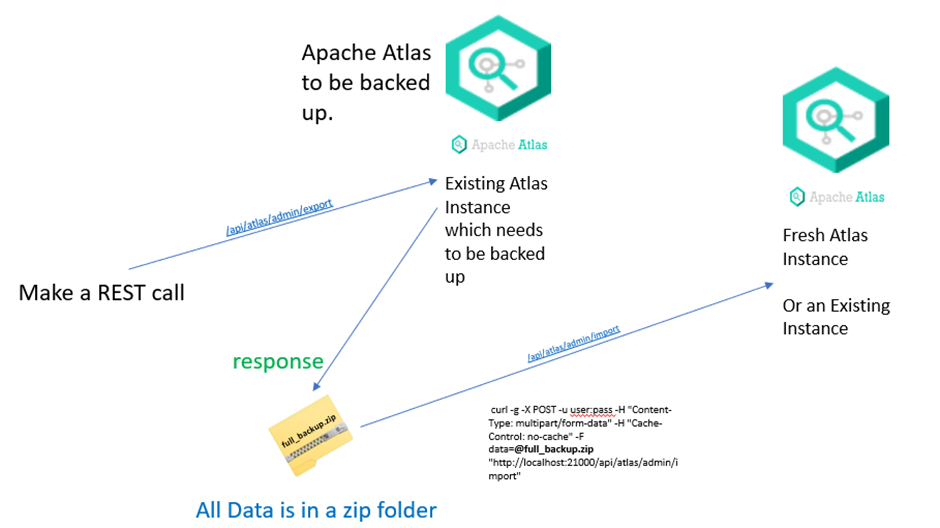

# Aurelius Atlas Backup

Here you will find how to back up Aurelius Atlas for moving instances.

This process will result in zip files of the Aurelius Atlas instance that can be used for backup and in the case of disaster recover process. 

# Apache Atlas backup
## Apache Atlas Backup Process Overview



## Acquire access token for Apache Atlas's admin user
You can use `oauth.sh` script from https://github.com/aureliusenterprise/Aurelius-Atlas-helm-chart. Example usage:
```
export ACCESS_TOKEN=$(./oauth.sh --endpoint https://aureliusdev.westeurope.cloudapp.azure.com/demo/auth/realms/m4i/protocol/openid-connect/token \
--client-id m4i_atlas \
--access atlas $ATLAS_USER_PASSWD)
```

## Export data from Apache Atlas
You can use `export-atlas.py` script, that wraps Apache Atlas's [Export API](https://atlas.apache.org/index.html#/ExportAPI) to export all data from Atlas. Example Usage:
```
pip install urlpath
python export-atlas.py --token $ACCESS_TOKEN \
--base-url https://aureliusdev.westeurope.cloudapp.azure.com/demo/atlas2/ \
--output out.zip
```
## Import Backup to Atlas Instance
Apache Atlas exposes an Import API from where data is imported from a zip file.
Admin user need rights are needed to use this api.
This command will import a file response.zip in the current directory to a specified atlas instance.

```bash
curl -g -X POST -H 'Authorization: Bearer <Bearer-Token>' -H "Content-Type: multipart/form-data" -H "Cache-Control: no-cache" -F data=@response.zip <apache-atlas-url>/api/atlas/admin/import

```

# Elasticsearch backup

For Elasticsearch backup you can use [Snapshot and restore API](https://www.elastic.co/guide/en/elasticsearch/reference/current/snapshot-restore.html).

## Create a snapshot repository

### Create a storage account and a container in Azure
1. Go to https://portal.azure.com/
2. Go to storage accounts service 

   

3. Create a new storage account 

   

4. Set the account name. Optionally adjust the redundancy and access tier 

   

   

5. Review and create
6. Once the account is created, go to Containers tab 

   

7. Create a new container 

   

   

8. Go to Access keys tab 

   

### Register a repository
1. Access Elastic's search pod/image, for example:
   ```
   kubectl -n demo exec -it pod/elastic-search-es-default-0 -- bash
   ```
2. Configure Elasticsearch's keystore with values from the Storage account's Access keys tab.
   
   

   ```
   bin/elasticsearch-keystore add azure.client.default.account
   bin/elasticsearch-keystore add azure.client.default.key
   ```
3. Optionally set a password for the keystore
   ```
   bin/elasticsearch-keystore passwd
   ```
4. Reload secure settings
   ```
   curl -X POST -u "elastic:$ELASTIC_PASSWORD" "https://aureliusdev.westeurope.cloudapp.azure.com/demo/elastic/_nodes/reload_secure_settings?pretty" -H 'Content-Type: application/json' -d "
   {
       \"secure_settings_password\": \"$ELASTIC_KEYSTORE_PASSWORD\"
   }"
   ```
5. Create the repository
   ```
   curl -X PUT -u "elastic:$ELASTIC_PASSWORD" "https://aureliusdev.westeurope.cloudapp.azure.com/demo/elastic/_snapshot/demo_backup?pretty" -H 'Content-Type: application/json' -d "
   {
     \"type\": \"azure\",
     \"settings\": {
       \"container\": \"aurelius-atlas-elastic-backup\",
        \"base_path\": \"backups\",
        \"chunk_size\": \"32MB\",
       \"compress\": true
     }
   }"
   ```
### Create a snapshot
```
curl -X POST -u "elastic:$ELASTIC_PASSWORD" "https://aureliusdev.westeurope.cloudapp.azure.com/demo/elastic/_snapshot/demo_backup/snapshot_2" -H 'Content-Type: application/json' -d '
{
  "indices": ".ent-search-engine-documents-*"
}'
```
